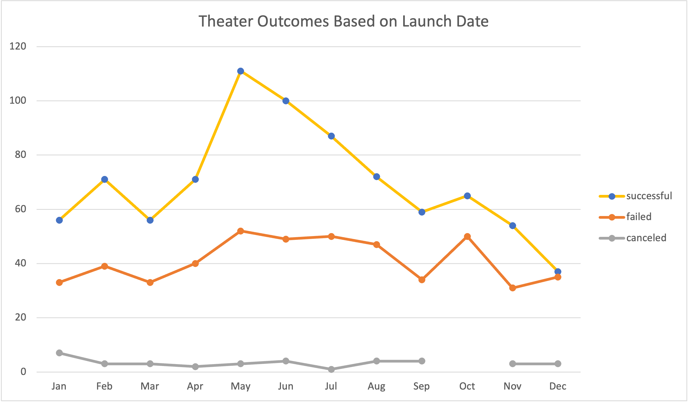
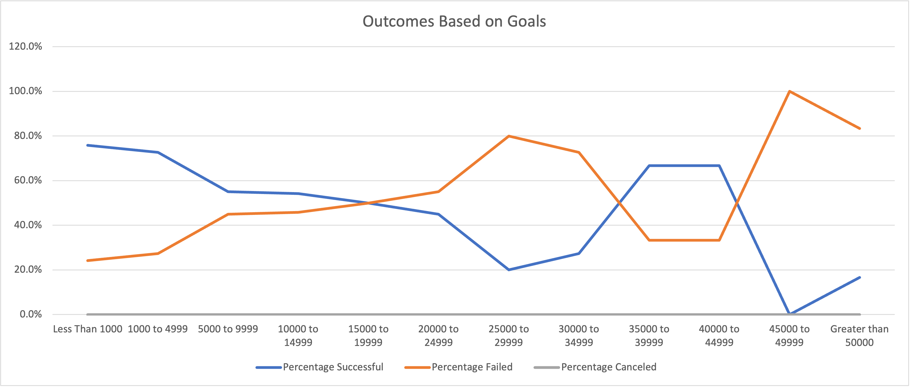

# Kickstarting with Excel

## Overview of Project

### Purpose
The purpose of this challenge was to provide further analysis of KickStarter campaign performance. The analysis specifically investigates campaign outcomes based on their launch dates and their funding goals.

## Analysis and Challenges
### Analysis

### Analysis of Outcomes Based on Launch Date

- For this deliverable, I created a **Year** column by using the year function based off of the table colum for  `=YEAR([@[Date Created Conversion]])`.
- I then created a pivot table that filtered on Category and Years with Outcomes in the columns and Date Created in the rows. The values were Count of outcomes. The row labels were created by removing the rows automatically added by Excel.
- Finally, is used the pivot table to create a line graph displaying the results.

### Analysis of Outcomes Based on Goals

- For this deliverable, I used the function `=COUNTIFS` to calculate the amount of play projects that fell into each Goal range for Successful, Failed, and Cancled statuses. Below is an example for successful play projects that had a goal of less than $1000. 
`=COUNTIFS(Kickstarter!$D:$D,"<1000",Kickstarter!$F:$F,"successful",Kickstarter!$R:$R,"plays")`
Here is a second example show how the function was adapted to account for a range between two numbers and for a failed status.
`=COUNTIFS(Kickstarter!$D:$D,">=1000",Kickstarter!$D:$D,"<=4999",Kickstarter!$F:$F,"failed",Kickstarter!$R:$R,"plays")`
- The total project for each goal range was calculated using the function `=SUM`. Below is an example the total of Less Than 1000:
`=SUM(B2,C2,D2)`
- The percentages of these projects was calculated using a simple division function and then changing the cell type to be **Percentage**.
- Lastly, the line graph was created by selecting all the data in the percentage column and inserting a line graph. The x-axis labels were then set to correspond with the Goal column.

### Challenges and Difficulties Encountered
A challenge that I encountered was figuring out why my **Outcomes Based on Goals** graph was different than the expected results in the example. The data I was pulling from was filtered to display only plays, but this was not reflected in my outcomes table. After thinking about the formula I was using, I realized that it did not reference the subcategory column `=COUNTIFS(Kickstarter!$D:$D,"<1000",Kickstarter!$F:$F,"successful")`. However once I accounted for the subcategory "plays" `=COUNTIFS(Kickstarter!$D:$D,"<1000",Kickstarter!$F:$F,"successful",Kickstarter!$R:$R,"plays")` the table adjusted and the graph was correct.

## Results

- What are two conclusions you can draw about the Outcomes based on Launch Date?
1. May had the must successful projects launched. In general, summer months had more sucessful projects. Based on these numbers, I would advise play Kickstarter projects to launch May through July.
2. The winter months had fewer successful projects. December had the least amount of successful projects and is the only month where successes and fails were almost equal. If the project has to launch in the winter I would recommend launching in February as it has the highest number of successful projects (out of the winter months) and only 39 failed projects.
- What can you conclude about the Outcomes based on Goals? 
1. If you are want to successfully fund your project you should make your goal less than $5000. Projects in these goal ranges were 76% and 73% successful.
- What are some limitations of this dataset? 
One noticeable limitation of the data set is the lack of projects with higher goals. This gap makes its difficult to analyze the success of these projects. Additionally, the data does not show how the projects were marketed or shared. It would be interesting to see the projects reach (how many page views, how many shares, where backers are located, etc.) These data points would provide further insight into what makes a project successfully funded.

- What are some other possible tables and/or graphs that we could create? 
Going off what I said above, I would make tables and graphs analyzing the affect that a staff pick or spotlight had on a project. These two features seem like they would have a positive correlation with successful projects.
